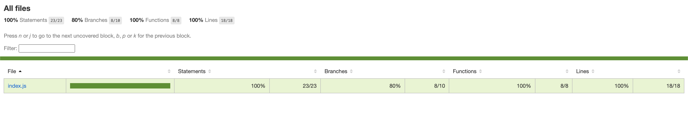

# JavaScript Challenge

## Description

A practical JavaScript challenge.

## Prerequisites

```
$ git >= v2
$ npm >= v6
$ nodejs >= v12
```

## Running unit testing

1. Open a terminal execute:

```zsh
$ npx jest
```

2. Run the following command to collect coverage report:

```zsh
$ npx jest --coverage
```


## Libraries and Tools

- [Git](https://git-scm.com/)
- [NPM](npmjs.com/)
- [EditorConfig](https://editorconfig.org/)
- [Jest](https://jestjs.io/)

## Author & Version Control

Developed by **Alan Nascimento - [Github](https://github.com/alan-nascimento)** - **_Published in March of 2022_**.
